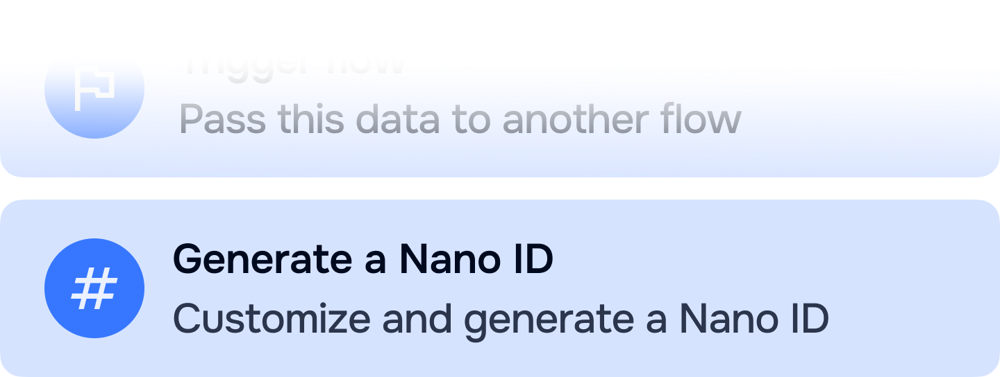

<p align="center">
    
</p>


# Introduction
A Directus operation extension that generates a NanoID for your Directus flows using the official [`nanoid`](https://github.com/ai/nanoid) package.
- **Customize your seed**: Use a the default alphabet (`A-Za-z0-9_-`) or use your own custom alphabet.
- **Set your length**: Modify the length of yoru NanoID according to your flow use-case.
- **Add a prefix or suffix**: Want to use Stripe-style identifiers? Add a prefix and suffix to generated NanoIDs.

# Installation

## Method 1: Directus Marketplace
The easiest way to install this package is via the Directus Marketplace, located inside of your Settings module.

## Method 2: npm
Install the extension by using `npm install` or the package manager of your choice (i.e. `pnpm`, `bun`) to your Directus project.
```sh
# Using pnpm
pnpm i directus-extension-operation-nanoid

# Using bun
bun i directus-extension-operation-nanoid

# Using npm
npm i directus-extension-operation-nanoid

# Using yarn
yarn add directus-extension-operation-nanoid
```

## Method 3: Manual
Clone this repository inside the `/extensions` folder of your Directus project.
```sh
git clone https://github.com/antonioso-ng/directus-extension-operation-nanoid
```

If you require further information on how to manually install the extension inside your self-hosted instance or Docker instance, you can check the following [Directus documentation](https://docs.directus.io/extensions/installing-extensions.html#installing-via-the-extensions-directory) on the topic.

# Developing
As with any project, clone this repository.
```sh
git clone https://github.com/antonioso-ng/directus-extension-operation-nanoid
```

Install project dependencies.
```sh
bun i
```

Run the extension on watch mode or build it.
```sh
# Develop and watch
bun run dev

# Build extension
bun run build
```


# Acknowledgements
- The [Directus](https://github.com/directus/directus) team for creating and maintaining an amazing platform with limitless potential.
- Andrey Sitnik for the [`nanoid`](https://github.com/ai/nanoid) package.

---

<div>
    <p align="center">
        Made with 💜 and 3 cups of ☕
    </p>
    <p align="center">
        Website <a href="https://antonioso.ng" target="_blank">antonioso.ng</a>
         •  
        GitHub <a href="https://github.com/antonioso-ng">@antonioso-ng</a>
         • 
        LinkedIn <a href="https://linkedin.com/in/antoniosong">@antoniosong</a>
    </p>
    <p align="center">
        This extension is released under the MIT license. See <a href="./LICENSE">LICENSE</a>  more information.
    </p>
</div>