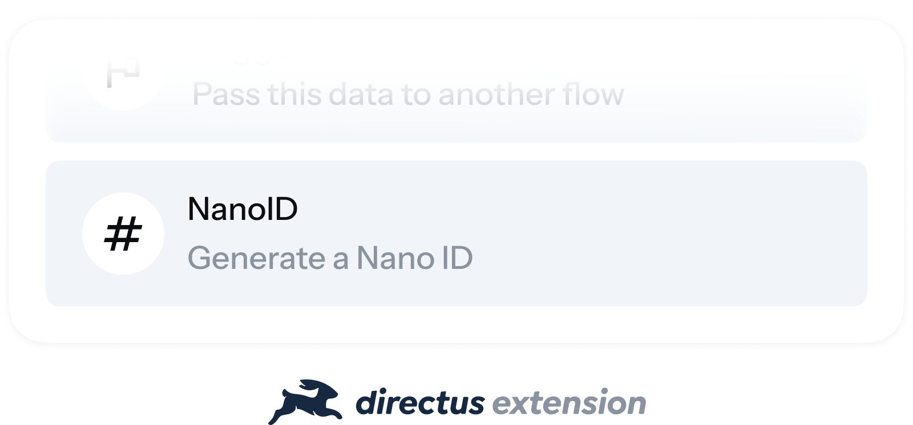
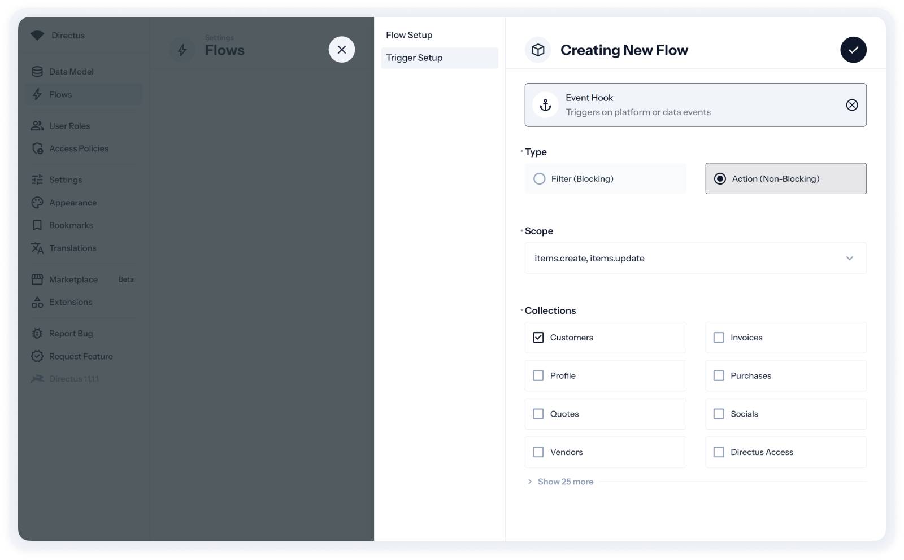
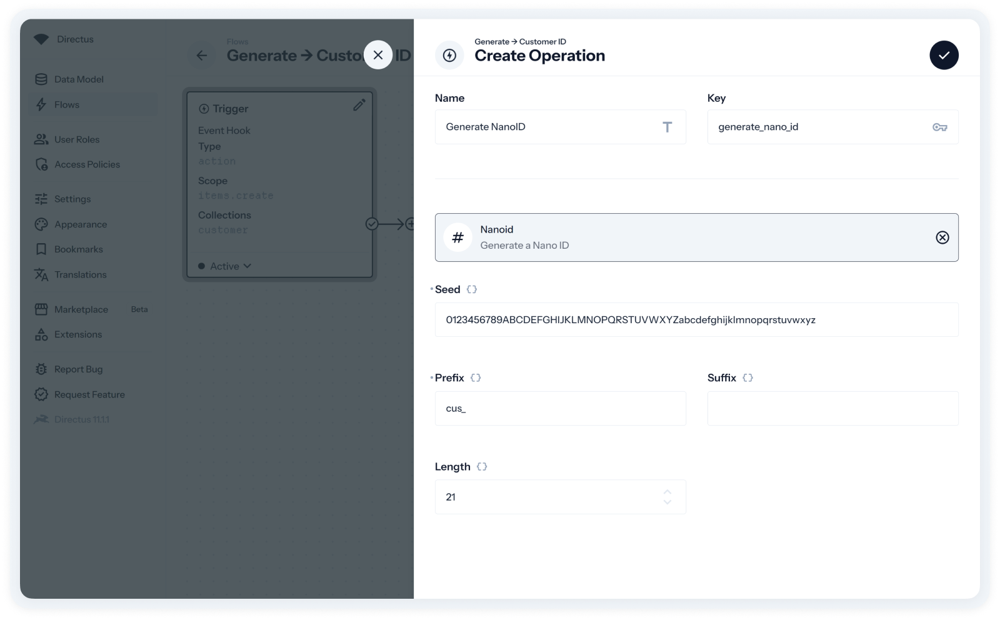
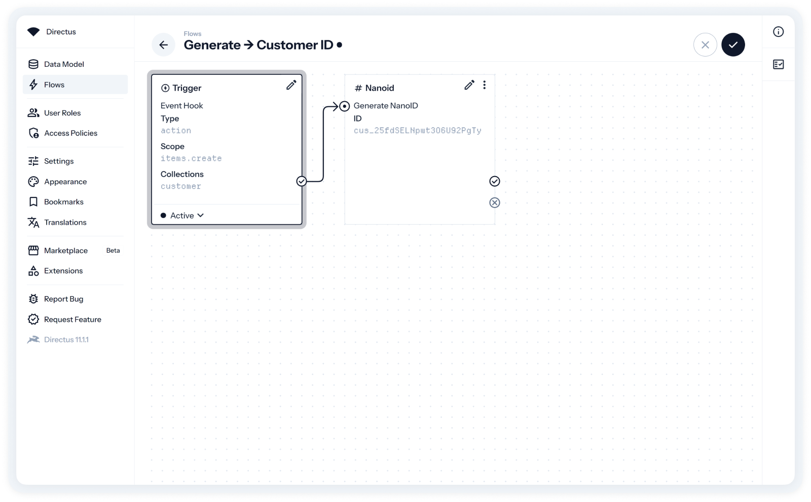
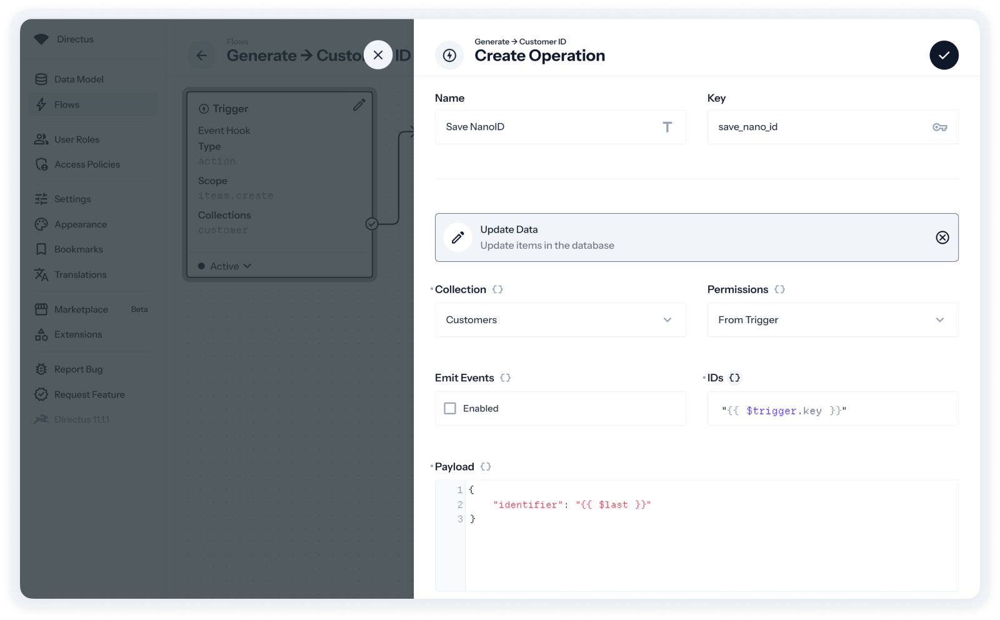
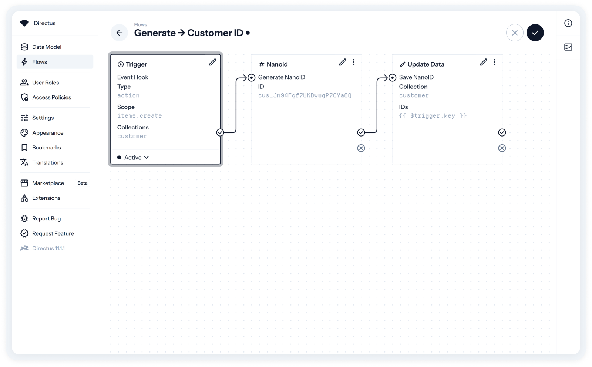

<p align="center">
    <picture>
        <source media="(prefers-color-scheme: dark)" srcset="./assets/dark/img_header.png" />
        
    </picture>
</p>

# Introduction
A Directus operation extension that generates a NanoID for your Directus flows using the official [`nanoid`](https://github.com/ai/nanoid) package.
- **Customize your seed**: Use the default alphabet (`A-Za-z0-9_-`) or use your own custom alphabet.
- **Set your length**: Modify the length of your NanoID according to your flow use-case.
- **Add a prefix or suffix**: Want to use Stripe-style identifiers? Add a prefix and suffix to generated NanoIDs.

# Use Cases
- **Alternate IDs**: Create secondary IDs for your Directus items and resources.
- **Unique identifiers**: Generate unique IDs for invoices, product codes, or any other specific needs.
- **URL shortening**: Produce short, shareable links or permalinks.

# Installation
## Install via Directus Marketplace
The easiest way to install this extension is through the Directus Marketplace, located inside of your Settings module.

## Install via Package Manager
Install the extension by using your preferred package manager (i.e. `pnpm`, `bun`).
```sh
# Using pnpm
pnpm i directus-extension-operation-nanoid

# Using bun
bun i directus-extension-operation-nanoid

# Using npm
npm i directus-extension-operation-nanoid

# Using yarn
yarn add directus-extension-operation-nanoid
```

## Install Manually
Clone this repository into the `/extensions` folder of your Directus project.
```sh
git clone https://github.com/antonioso-ng/directus-extension-operation-nanoid
```

If you require further information on how to manually install the extension inside your self-hosted instance or Docker instance, refer to the [Directus documentation](https://docs.directus.io/extensions/installing-extensions.html#installing-via-the-extensions-directory).

# Usage
1. Create a Directus flow with your chosen trigger.
2. Add the NanoID operation to your flow.
3. Customize operation according to your needs by modifying the following options.
    - **Seed**: The operation includes a default NanoID seed. You can specify a different seed value if you require deterministic IDs across executions.
    - **Prefix**: Add a string to prepend to each generated NanoID, helping categorize or identify your IDs easily.
    - **Suffix**: Include a string to append to each generated NanoID, providing additional context or uniqueness.
    - **Length**: Set the desired length for the generated NanoID. The default is typically 21 characters, but you can adjust it as needed.
4. Save the operation and preview an example of a generated NanoID using your settings.
5. Finish your flow and see it in action.

# Step-by-Step
### Create a Directus flow
For most flows, the recommended trigger will be an **Event Hook** with the **`items.create`** scope. This trigger will be used to generate a NanoID upon the creation of an item in the selected collections.
<p align="center">
    <picture>
        <source media="(prefers-color-scheme: dark)" srcset="./assets/dark/img_usage_1.png" />
        
    </picture>
</p>

### Add the NanoID operation
From the initial trigger card, add a new operation and select the NanoID operation, which can be found at the bottom of the operations list. You can then customize the NanoID to suit your requirements.

The example below demonstrates how to create a Stripe-like NanoID, complete with a custom prefix and seed.
<p align="center">
    <picture>
        <source media="(prefers-color-scheme: dark)" srcset="./assets/dark/img_usage_2.png" />
        
    </picture>
</p>

### Save and preview the NanoID operation
After saving the operation, you can preview the generated NanoID. The result can be accessed by using `{{ $last }}` in subsequent operations.
<p align="center">
    <picture>
        <source media="(prefers-color-scheme: dark)" srcset="./assets/dark/img_usage_3.png" />
        
    </picture>
</p>

### Save the NanoID to the trigger item
To save the generated NanoID, create an Update Data operation. In this example, the Customer collection includes a field named `identifier`, where the generated NanoID will be stored.

You will assign the trigger's item ID using `{{ $trigger.key }}` and set the payload to update the identifier field with the value `{{ $last }}`.
<p align="center">
    <picture>
        <source media="(prefers-color-scheme: dark)" srcset="./assets/dark/img_usage_4.png" />
        
    </picture>
</p>

### Save your flow and test it
After saving and activating your flow, test it to ensure that your custom NanoID is generated and stored in the `identifier` field whenever a new item is created in the assigned collection.
<p align="center">
    <picture>
        <source media="(prefers-color-scheme: dark)" srcset="./assets/dark/img_usage_5.png" />
        
    </picture>
</p>

# Developing
To contribute or customize the extension, clone the repository.
```sh
git clone https://github.com/antonioso-ng/directus-extension-operation-nanoid
```

Install project dependencies using your preferred package manager.
```sh
bun i
```

Run the extension on watch mode or build it.
```sh
# Develop and watch
bun run dev

# Build extension
bun run build
```

# FAQ
### What is NanoID?
NanoID is a small, secure, and URL-friendly unique string ID generator. It's an excellent alternative to UUID for creating compact and non-sequential identifiers in your applications.

You can find more information about NanoID [right here](https://github.com/ai/nanoid).

### Why should I use it?
This extension offers a powerful and simple alternative for generating custom identifiers beyond the standard options available in Directus.

NanoIDs are highly customizable, secure, and significantly smaller than UUIDs, making them an excellent choice for any project.

### What if I encounter issues?
If you run into any issues, first ensure you are using the latest version of Directus and that your flows are set up correctly.

If the problem persists, please open a new issue on GitHub, including detailed information about the issue you’re experiencing.

### How can I contribute?
To get started, follow the steps outlined in the [Developing](#developing) section by forking this repository. Begin by forking this repository, creating a new branch, and implementing any changes you'd like to propose.

When you're ready, commit your changes following the Git Conventional Commits guidelines and submit a pull request. I’ll review your contributions and provide feedback or approval.

# Acknowledgements
- The [Directus](https://github.com/directus/directus) team for creating and maintaining an amazing platform with limitless potential.
- Andrey Sitnik for the [`nanoid`](https://github.com/ai/nanoid) package.

---

<div>
    <p align="center">
        Made with 💜 and 5 cups of ☕
    </p>
    <p align="center">
        Website <a href="https://antonioso.ng" target="_blank">antonioso.ng</a>
         •  
        <a href="https://buymeacoffee.com/antoniosong">Buy Me a Coffee ☕</a>
         • 
        LinkedIn <a href="https://linkedin.com/in/antoniosong">@antoniosong</a>
    </p>
    <p align="center">
        This extension is released under the MIT license. See <a href="./LICENSE">LICENSE</a>  more information.
    </p>
</div>